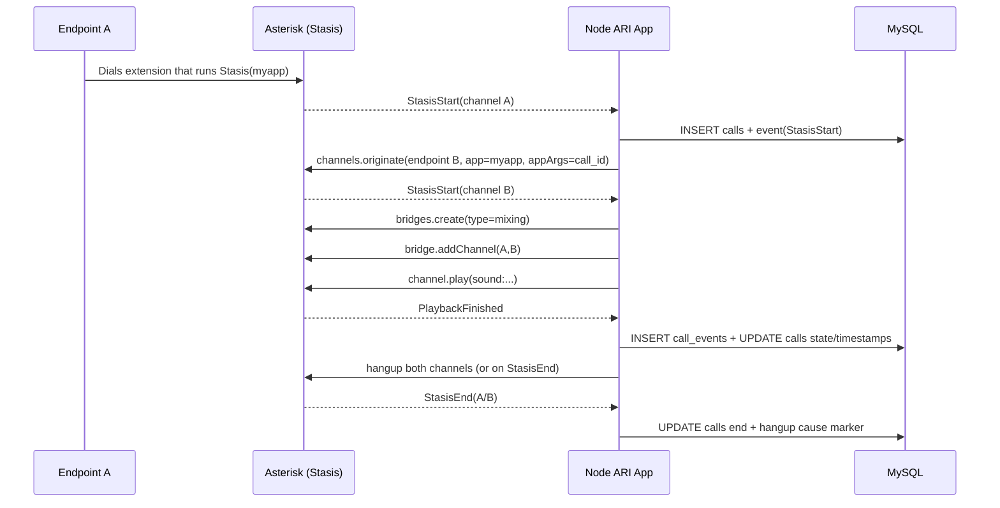
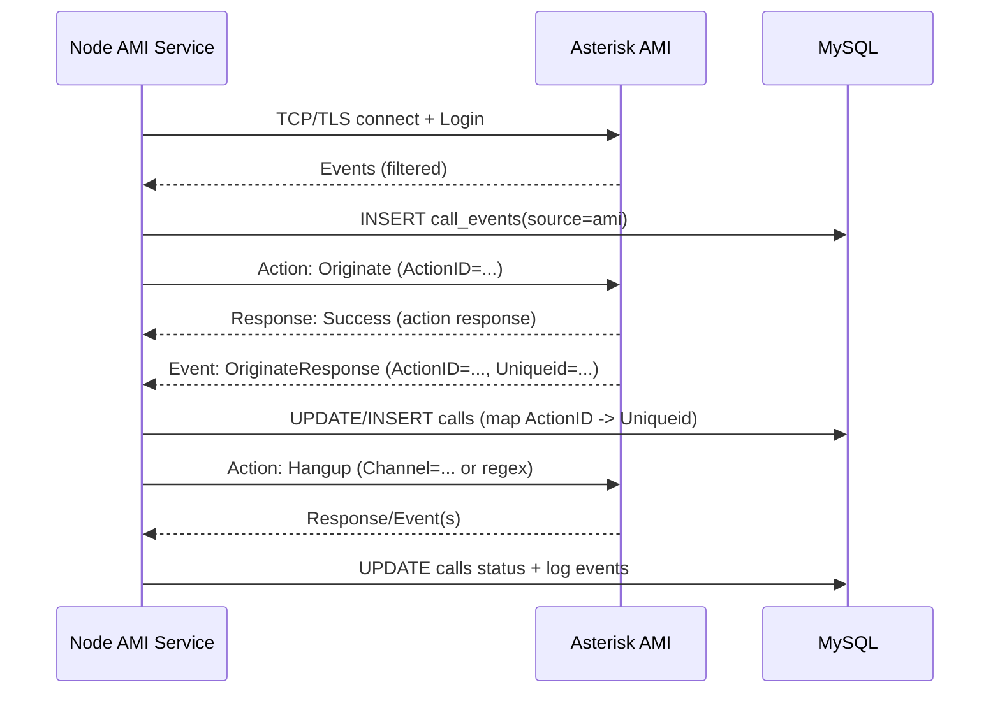

# Implementing Asterisk ARI and AMI in a Node.js and MySQL Stack for Asterisk 22 LTS

## Executive summary

Asterisk offers two widely used external control surfaces: **ARI** (Asterisk REST Interface) and **AMI** (Asterisk Manager Interface). They overlap just enough to confuse architecture decisions, but they are *optimised for different jobs*. ARI is the right tool when you want your application to **own the call experience**—bridges, channels, media, and rich event-driven logic—because it exposes Asterisk’s primitives (channels/bridges/endpoints/media) and streams state as JSON events over WebSocket. citeturn11view3 AMI is the right tool when you want to **monitor and manage** Asterisk—event feeds plus action commands—while the dialplan remains the primary call-execution environment; AMI behaves as an asynchronous message bus of actions and events, and you must correlate responses/events yourself. citeturn12search5

For **Node.js**, the most “official” ARI client is the Asterisk project’s `ari-client` (repo: `asterisk/node-ari-client`), which supports callback and Promise styles and provides ARI-resource wrappers. citeturn3view2turn10view0 It also documents WebSocket reconnection lifecycle events and an important scaling constraint: **only one WebSocket can subscribe to a given ARI application at a time**; a newer subscription “wins” and the older socket receives an `ApplicationReplaced` event. citeturn10view1 For AMI, widely used Node choices include `asterisk-ami-client` (Promise/event-emitter patterns and built-in reconnection support) citeturn9view1 and `asterisk-manager` (NodeJS-AsteriskManager) with `keepConnected()` for resilience. citeturn17view0 A newer minimalist option is `yana`, which is dependency-light, Promise-friendly, and supports auto-reconnect. citeturn17view3

For **Asterisk 22 LTS on Ubuntu 22.\***, the Ubuntu Jammy repository package is commonly **Asterisk 18.10.x** (example shown via `apt search asterisk`), so installing **Asterisk 22 LTS** typically means **building from source** or using a dedicated PBX distribution. citeturn22view0 The Asterisk project provides an official download page (showing the current 22 LTS release line) citeturn22view2 and documentation covering what to download (the `asterisk-{version}-current.tar.gz` links) citeturn23search2 plus the `install_prereq` script workflow for prerequisites. citeturn22view1

From a data perspective, ARI and AMI events give you enough identifiers to build robust MySQL logging—particularly by unifying around a **generated `call_id`** in your app and mapping Asterisk identifiers like **`Uniqueid`**/**`Linkedid`** (AMI events) citeturn12search9 and ARI channel IDs. For MySQL, you will want transactional updates for call state (InnoDB is transaction-centric) citeturn14search0turn14search4 and careful indexing; JSON payloads are best stored in JSON columns but indexed via generated columns when needed. citeturn14search1turn14search16

Finally, your user-facing requirement adds a web console: a **React + Material UI** dashboard (plus complementary UI libraries) that can show live events and allow basic actions (originate, hangup). This is best implemented with a backend event fan-out via WebSocket/SSE so the UI does not connect directly to AMI/ARI.

## ARI and AMI fundamentals and decision framework

### What ARI is designed for

ARI is described in Asterisk documentation as an asynchronous interface intended for building **custom communications applications** by exposing Asterisk primitives (channels, bridges, endpoints, media) through a RESTful API with state conveyed as JSON events over WebSocket. citeturn11view3 Calls are handed to your app by the **Stasis** dialplan application, which triggers `StasisStart` when the channel enters your app and `StasisEnd` when it leaves. citeturn12search14

This model makes ARI ideal when your Node.js service must:
- Orchestrate call legs and bridging logic in near real-time.
- Run interactive media flows (playbacks, recordings, DTMF-driven state machines).
- Maintain an application-owned call state machine and persist it to MySQL.

### What AMI is designed for

AMI is specified as an asynchronous message bus of **actions** (commands a client sends) and **events** (messages Asterisk emits). It is commonly used to manage Asterisk and channels, but it does not “decide” what executes on a channel—that remains primarily the dialplan/AGI domain—while still allowing call generation and aspects of call flow and system internals. citeturn12search5 Importantly, because AMI is asynchronous, actions and events are not synchronised; correlating follow-on events back to actions is your responsibility (often via `ActionID`). citeturn12search5

This model makes AMI ideal when your Node.js service must:
- Monitor system activity (calls, endpoints, queues, registries, status).
- Trigger basic actions (Originate, Hangup) without implementing full ARI-style call control.
- Feed dashboards/CRMs/alerting pipelines with event streams.

### ARI vs AMI comparison table

| Dimension | ARI | AMI |
|---|---|---|
| Primary intent | Build application-owned call logic using Asterisk primitives citeturn11view3 | Manage/monitor Asterisk via actions + events message bus citeturn12search5 |
| Control handoff | Via `Stasis()` in the dialplan; events `StasisStart`/`StasisEnd` define app control window citeturn12search14turn3view1 | No equivalent “control window”; dialplan still defines execution; AMI influences via actions citeturn12search5 |
| Transport shape | REST (HTTP/HTTPS) + WebSocket (WS/WSS) JSON events citeturn11view3turn3view1 | TCP/TLS and optionally HTTP/HTTPS transports; line-based headers citeturn19search4turn12search5 |
| Event model | JSON WebSocket event stream; per-resource subscription behaviour (implicit for Stasis channels; explicit for some resources like bridges) citeturn12search14turn11view2 | Continuous event stream; can filter events to reduce overhead (recommended) citeturn12search20turn8view0 |
| Best for | Interactive call control, media, bridging, custom voicemail/IVR/conferencing logic citeturn11view3turn11view2 | Monitoring, queue stats, external integrations, basic originate/hangup, operational control citeturn12search5turn12search1turn12search0 |
| Scaling gotcha | One WebSocket subscription per ARI application name; newer subscriber replaces older (`ApplicationReplaced`) citeturn10view1 | Multiple clients can connect; still must manage event volume and correlation citeturn12search5turn12search20 |

### When to use each in practice

A pragmatic split that holds up under load is:

- Use **ARI** for the pieces where your application needs **fine-grained call control**: multi-leg origination, bridging logic (holding/mixing), media playback/recording, DTMF-driven state machines, and call state held in Node + MySQL. ARI directly supports originate via the Channels REST API and can auto-subscribe the channel to your Stasis app if you provide an app name. citeturn13view2turn11view3
- Use **AMI** for **monitoring and coarse control**: capturing call lifecycle events for dashboards and analytics, handling fleet/queue state, and providing “click-to-call” originate/hangup patterns—especially when you are not taking ownership of the call in Stasis. AMI’s `Originate` and `Hangup` actions are well-defined and can be correlated via `ActionID` and associated response events (`OriginateResponse`, `Hangup`). citeturn12search1turn12search0turn12search8turn12search9

## Node.js libraries and API patterns

### Library landscape and selection logic

You asked for both “official” and popular community clients. The Node ecosystem here is fragmented; the safest approach is to pick:
- One ARI client with an API style you can live with (and whose reconnection semantics you control).
- One AMI client with explicit reconnect + event handling support.
- Then wrap both inside your own interfaces so you can replace the library later without rewriting business logic.

### Node.js libraries table (ARI + AMI)

| Interface | Library | Status signals from sources | Pros | Cons / risk |
|---|---|---|---|---|
| ARI | `ari-client` (Asterisk `node-ari-client`) citeturn3view2turn10view0 | “Best effort with limited support” repo note citeturn10view0 | Official Asterisk repo; rich resource wrappers; callback + Promise usage; documents WebSocket reconnect lifecycle events citeturn3view2turn10view1 | “Best effort” support; you must design carefully for clustering because only one WebSocket can subscribe per ARI application citeturn10view1 |
| ARI | `@ipcom/asterisk-ari` citeturn5view1 | Modern TS, “automatic reconnection management”, full type support citeturn5view1 | TypeScript-first; explicit reconnection features; ESM + CJS support citeturn5view1 | Newer/smaller ecosystem; verify coverage against your Asterisk 22 feature set |
| ARI | `awry` citeturn5view0 | Archived (Sep 2025) citeturn5view0 | Clean separation of API + events; includes reconnecting WebSocket module reference citeturn5view0 | Archived → higher maintenance risk, security patch gap citeturn5view0 |
| ARI | `@per_moeller/asterisk-ari` citeturn6search2 | “Modern TypeScript ARI client” with reconnection; recently published (Jan 2026) citeturn6search2 | Modern TS ergonomics; reconnection is a first-class goal citeturn6search2 | New package: validate stability and long-term maintenance |
| AMI | `asterisk-ami-client` citeturn9view1 | Promise-based actions; events including `reconnection`; options `reconnect`, `keepAlive` citeturn9view1 | Clear event emitter model; can emit by event type; can bind responses by ActionID citeturn9view1 | Node support statement is legacy (>=4); you must test with modern Node and TLS behaviours citeturn9view1 |
| AMI | `asterisk-manager` (NodeJS-AsteriskManager) citeturn17view0 | Provides `keepConnected()` and event listeners citeturn17view0 | Widely referenced historically; simple usage; reconnect helper citeturn17view0 | Older conventions (`hangup` lowercase event names, wiki links); may need wrappers for modern typed code citeturn17view0 |
| AMI | `yana` citeturn17view3 | “small”, “no dependencies”, Promise/async-await; auto-reconnect in constructor options citeturn17view3 | Minimal surface area; good for building your own stable wrapper citeturn17view3 | “Tested with Asterisk 11–20” so you must validation-test against Asterisk 22 in your environment citeturn17view3 |

### Installation and authentication patterns

#### ARI server-side configuration essentials

ARI needs:
- Asterisk built-in HTTP server enabled (in `http.conf`) citeturn3view1turn19search1  
- An ARI user in `ari.conf` citeturn3view1turn19search1  
- A dialplan entry using `Stasis(app-name)` to hand channels to your application citeturn3view1turn12search14  

Asterisk’s ARI “Getting Started” demonstrates the WebSocket event connection pattern using a query string `api_key=username:password&app=...` (example with `wscat`). citeturn3view1

For production, the ARI configuration documentation explicitly recommends encrypting HTTP signalling with TLS (HTTPS/WSS). citeturn2search5turn1search3

#### ARI client-side connection management and reconnection

`ari-client` exposes `connect(url, username, password)` and returns an ARI client that has resource collections like `ari.bridges`, `ari.channels`, etc. citeturn3view2 It also enumerates WebSocket lifecycle events such as `WebSocketReconnecting`, `WebSocketConnected`, and `WebSocketMaxRetries`. citeturn10view1

The most operationally important ARI scaling fact (and it directly affects Node clustering): only one WebSocket may subscribe to an ARI application, and if multiple connect, the newer replaces the older and the older receives `ApplicationReplaced`. citeturn10view1

#### AMI server-side configuration essentials

From Asterisk’s sample `manager.conf`, the project warns you should **not enable AMI on a public IP address**, and suggests firewalling and tunnelling (IPsec/SSH/VPN) or TLS. citeturn8view0 The same sample shows TLS parameters and implies a TLS listener default port of **5039** when enabled. citeturn8view0

AMI also supports TLS (and HTTP/HTTPS) per the AMI v2 specification. citeturn19search4turn12search5

#### AMI event stream control (performance + stability)

Event volume kills AMI consumers long before CPU does. You should proactively filter events. The Asterisk documentation explicitly positions **advanced event filtering** as recommended to reduce bandwidth/processing overhead and describes hashing-based event-name selection. citeturn12search20turn8view0

### MySQL client pattern for Node.js

For MySQL integration, `mysql2` is a common choice because it supports promise-based connections, prepared statements, and pooling; its own docs show `mysql2/promise` usage and describe why pooling reduces connection overhead. citeturn18view0

## System architecture with MySQL and a Material UI dashboard

The reference architecture below intentionally treats ARI/AMI connectivity as a **backend responsibility**. Your UI (Material UI + other libraries) should not talk to AMI/ARI directly; instead it consumes sanitised APIs and a live event stream from your Node backend.

```mermaid
flowchart LR
  subgraph A[Asterisk 22 LTS]
    ARI[ARI: HTTP/HTTPS + WS/WSS]
    AMI[AMI: TCP/TLS (5038/5039)]
    DP[Dialplan + Stasis()]
  end

  subgraph N[Node.js Backend]
    API[REST API\nExpress/Fastify]
    CC[Call Control Service\n(ARI client)]
    MON[Monitoring Service\n(AMI client)]
    BUS[Event Fanout\nWS/SSE + internal queue]
  end

  subgraph DB[MySQL (InnoDB)]
    CALLS[(calls)]
    EVENTS[(call_events)]
  end

  subgraph UI[Web UI]
    FE[React + Material UI]
    LIVE[Live event view\nDataGrid/Charts]
  end

  DP --> ARI
  ARI <--> CC
  AMI <--> MON

  CC --> DB
  MON --> DB

  CC --> BUS
  MON --> BUS
  BUS --> API
  API --> FE
  BUS --> LIVE
```

Key architectural implications:

- **Single-writer rule for ARI call control**: Because ARI application subscriptions can be replaced, you should treat the “call control service” as a singleton per ARI app name, even if the API/UI tier scales horizontally. citeturn10view1  
- **AMI consumers can be replicated, but should be filtered**: Multiple AMI clients are feasible, but filtering is the first lever to reduce load. citeturn12search20turn12search5  
- **Database writes must be low-latency and resilient**: Use a pool (not per-event connections) citeturn18view0 and design your schema so that common dashboard queries are index-friendly. citeturn14search10turn14search2  

## Example implementation: ARI call control with MySQL

This section provides a concrete ARI pattern for **originate → bridge → play → hangup** with MySQL call logging. It assumes:
- Asterisk **22 LTS** is installed and ARI enabled.
- SIP endpoints and dialplan context are present (exact call flow is otherwise unspecified).

### Minimal Asterisk configuration snippets for ARI

**`/etc/asterisk/http.conf` (enable HTTP, preferably TLS for production)**  
Asterisk ARI requires the HTTP server; TLS is strongly recommended for production. citeturn19search1turn2search5  
Ports commonly used are 8088 (HTTP) and 8089 (HTTPS), as shown in Asterisk documentation examples. citeturn2search5turn1search3

**`/etc/asterisk/ari.conf` (create ARI user)**  
The ARI getting-started guide shows configuring an ARI user in `ari.conf`. citeturn3view1

**`/etc/asterisk/extensions.conf` (send channels into Stasis)**  
Channels are handed to ARI through `Stasis(app)`. citeturn12search14turn3view1

Example (your contexts/extensions will differ):
```ini
[ari-entry]
exten => 7000,1,NoOp(Enter ARI app)
 same => n,Stasis(myapp)
 same => n,Hangup()
```

### ARI event flow diagram



### MySQL tables used by this example

You can implement ARI logging with the schema in the later “MySQL schema” section; the code below assumes:
- `calls` table with `call_id` (UUID string) and status fields
- `call_events` table with JSON payloads

### Node.js ARI code example (using `ari-client`) + MySQL logging

The official Asterisk ARI Node client installs as `npm install ari-client` and connects via `connect(url, username, password)`. citeturn3view2  
ARI originate is done via `POST /channels` (“Create a new channel (originate) … if a Stasis application is provided … subscribed to the originated channel”). citeturn13view2  
Playback supports media URIs like `sound:`, `recording:`, `digits:`, etc. citeturn12search2

Below is a compact but realistic pattern. It focuses on correctness and traceability rather than being a full framework.

```js
// ari_call_control.js
// Node.js CommonJS for compatibility with ari-client.
// Requires: npm i ari-client mysql2 uuid

const ari = require('ari-client');
const mysql = require('mysql2/promise');
const { v4: uuidv4 } = require('uuid');

const cfg = {
  ariUrl: process.env.ARI_URL || 'http://127.0.0.1:8088',
  ariUser: process.env.ARI_USER,
  ariPass: process.env.ARI_PASS,
  ariApp: process.env.ARI_APP || 'myapp',

  mysqlHost: process.env.MYSQL_HOST || '127.0.0.1',
  mysqlUser: process.env.MYSQL_USER,
  mysqlPass: process.env.MYSQL_PASS,
  mysqlDb: process.env.MYSQL_DB || 'telephony',
};

function requireEnv(name, value) {
  if (!value) throw new Error(`Missing env: ${name}`);
}

async function main() {
  requireEnv('ARI_USER', cfg.ariUser);
  requireEnv('ARI_PASS', cfg.ariPass);
  requireEnv('MYSQL_USER', cfg.mysqlUser);
  requireEnv('MYSQL_PASS', cfg.mysqlPass);

  const pool = mysql.createPool({
    host: cfg.mysqlHost,
    user: cfg.mysqlUser,
    password: cfg.mysqlPass,
    database: cfg.mysqlDb,
    waitForConnections: true,
    connectionLimit: 10,
    enableKeepAlive: true,
  });

  const ariClient = await ari.connect(cfg.ariUrl, cfg.ariUser, cfg.ariPass);

  // ARI websocket readiness/reconnect observability:
  ariClient.on('WebSocketReconnecting', (err) => console.warn('ARI WS reconnecting:', err?.message));
  ariClient.on('WebSocketConnected', () => console.info('ARI WS connected'));
  ariClient.on('WebSocketMaxRetries', (err) => console.error('ARI WS max retries, manual intervention:', err?.message));

  // Track live calls in-memory for quick correlation
  const calls = new Map(); // callId -> {bridgeId, aChanId, bChanId}

  // Core handler: both inbound StasisStart and our originated leg will arrive here.
  ariClient.on('StasisStart', async (event, channel) => {
    const callId = extractCallId(event) || uuidv4(); // If inbound without args, create one.

    // Persist an event row (best effort) + upsert call row
    await logEvent(pool, callId, 'ari', 'StasisStart', { event, channel: safeChannel(channel) });
    await upsertCall(pool, callId, { status: 'in_stasis', started_at: new Date() });

    // If this is the first leg, store as A; if second leg, store as B, then bridge.
    const state = calls.get(callId) || {};
    if (!state.aChanId) {
      state.aChanId = channel.id;
      calls.set(callId, state);

      // Optional: answer inbound if it isn't already up
      try { await channel.answer(); } catch (_) {}

      // Example: if inbound brings no appArgs, you can decide logic here:
      // - put into holding bridge
      // - or wait for an API-trigger before dialling out
      return;
    }

    if (!state.bChanId && channel.id !== state.aChanId) {
      state.bChanId = channel.id;
      calls.set(callId, state);

      await bridgeAndEntertain(ariClient, pool, callId, state);
    }
  });

  ariClient.on('StasisEnd', async (event, channel) => {
    const callId = extractCallId(event);
    await logEvent(pool, callId || 'unknown', 'ari', 'StasisEnd', { event, channel: safeChannel(channel) });

    // Mark ended (idempotent update)
    if (callId) {
      await updateCall(pool, callId, {
        status: 'ended',
        ended_at: new Date(),
      });
    }
  });

  ariClient.start(cfg.ariApp);

  // Example exported function to originate and bridge two endpoints.
  // In a real app, call this from an HTTP endpoint (UI button).
  global.originateBridgePlayHangup = async function originateBridgePlayHangup(endpointA, endpointB) {
    const callId = uuidv4();
    calls.set(callId, {});

    await upsertCall(pool, callId, {
      status: 'origination_requested',
      started_at: new Date(),
      a_endpoint: endpointA,
      b_endpoint: endpointB,
    });

    // Originating leg A into our Stasis app (auto-subscribed if app provided).
    // ARI originate is "POST /channels" and returns a snapshot immediately. citeturn13view2
    await ariClient.channels.originate({
      endpoint: endpointA,
      app: cfg.ariApp,
      appArgs: callId,
      callerId: 'ARI-App <7000>',
      variables: { CALL_ID: callId },
    });

    // Originating leg B as well; they will both hit StasisStart, then be bridged in handler.
    await ariClient.channels.originate({
      endpoint: endpointB,
      app: cfg.ariApp,
      appArgs: callId,
      callerId: 'ARI-App <7000>',
      variables: { CALL_ID: callId },
    });

    return callId;
  };

  console.info(`ARI app started: ${cfg.ariApp}`);
}

// --- ARI helpers ---

function extractCallId(event) {
  // For StasisStart/End, app args can carry correlation.
  // Different ARI clients expose this slightly differently; we handle both.
  const args = event?.args;
  if (Array.isArray(args) && args.length > 0 && typeof args[0] === 'string') return args[0];
  return null;
}

function safeChannel(channel) {
  if (!channel) return null;
  return { id: channel.id, name: channel.name, state: channel.state };
}

async function bridgeAndEntertain(ariClient, pool, callId, state) {
  const bridge = await ariClient.bridges.create({ type: 'mixing' });
  state.bridgeId = bridge.id;

  await logEvent(pool, callId, 'ari', 'BridgeCreated', { bridgeId: bridge.id });
  await updateCall(pool, callId, { status: 'bridging', bridge_id: bridge.id });

  // Add both channels to the bridge
  await ariClient.bridges.addChannel({ bridgeId: bridge.id, channel: `${state.aChanId},${state.bChanId}` });

  await logEvent(pool, callId, 'ari', 'BridgeAddChannel', { bridgeId: bridge.id, channels: [state.aChanId, state.bChanId] });
  await updateCall(pool, callId, { status: 'in_bridge' });

  // Play a sound to channel A (could also play to the bridge depending on your design)
  // Media URI types include sound:, recording:, digits:, etc. citeturn12search2
  const playback = ariClient.Playback();
  playback.on('PlaybackFinished', async () => {
    await logEvent(pool, callId, 'ari', 'PlaybackFinished', { playbackId: playback.id });

    // Hang up both legs after media completes
    await hangupSafe(ariClient, state.aChanId);
    await hangupSafe(ariClient, state.bChanId);

    await updateCall(pool, callId, { status: 'hangup_sent' });
  });

  await ariClient.channels.play({ channelId: state.aChanId, media: 'sound:hello-world' }, playback);
  await logEvent(pool, callId, 'ari', 'PlaybackStarted', { playbackId: playback.id, channelId: state.aChanId });
}

async function hangupSafe(ariClient, channelId) {
  if (!channelId) return;
  try {
    await ariClient.channels.hangup({ channelId });
  } catch (_) {
    // Channel may already be gone; ignore.
  }
}

// --- MySQL logging helpers ---

async function upsertCall(pool, callId, fields) {
  // Minimal upsert for demo purposes.
  // In production, prefer explicit state transitions + optimistic checks.
  const now = new Date();
  const startedAt = fields.started_at || null;

  await pool.execute(
    `
    INSERT INTO calls (call_id, status, started_at, a_endpoint, b_endpoint, bridge_id, created_at, updated_at)
    VALUES (?, ?, ?, ?, ?, ?, ?, ?)
    ON DUPLICATE KEY UPDATE
      status = VALUES(status),
      bridge_id = COALESCE(VALUES(bridge_id), bridge_id),
      updated_at = VALUES(updated_at)
    `,
    [
      callId,
      fields.status || 'new',
      startedAt,
      fields.a_endpoint || null,
      fields.b_endpoint || null,
      fields.bridge_id || null,
      now,
      now,
    ]
  );
}

async function updateCall(pool, callId, fields) {
  const cols = [];
  const vals = [];
  for (const [k, v] of Object.entries(fields)) {
    cols.push(`${k} = ?`);
    vals.push(v);
  }
  cols.push('updated_at = ?');
  vals.push(new Date());
  vals.push(callId);

  await pool.execute(`UPDATE calls SET ${cols.join(', ')} WHERE call_id = ?`, vals);
}

async function logEvent(pool, callId, source, eventType, payload) {
  await pool.execute(
    `
    INSERT INTO call_events (call_id, source, event_type, event_time, payload_json)
    VALUES (?, ?, ?, ?, ?)
    `,
    [callId, source, eventType, new Date(), JSON.stringify(payload)]
  );
}

main().catch((err) => {
  console.error(err);
  process.exit(1);
});
```

#### Notes on robustness and limits

- **Bridging patterns**: Asterisk documentation explicitly describes putting channels into holding bridges and moving into mixing bridges when the second leg answers. citeturn11view1turn11view2 Your production logic likely needs that (especially for inbound calls), plus cleanup when one leg ends.
- **Subscriptions**: Bridges are not automatically subscribed to for events; you may need explicit subscriptions for some bridge-level events via applications resource. citeturn11view2
- **Clustering warning**: if you run multiple nodes with the same ARI application name, you will get takeovers (`ApplicationReplaced`). citeturn10view1

## Example implementation: AMI monitoring and basic call control with MySQL

This section provides a concrete AMI pattern for:
- Receiving events (e.g., `Hangup`) and logging them
- Performing `Originate` and `Hangup` actions
- Correlating originate results using `OriginateResponse`

### AMI event flow diagram



### AMI actions/events used (and why)

- **Originate action**: supports fast origination (`Async=true`) and setting caller ID and variables, plus a `ChannelId` (UniqueId) if you want to supply one. citeturn12search1  
- **Hangup action**: can hang up an exact channel or apply a regex format `/regex/`. citeturn12search0  
- **OriginateResponse event**: explicitly “raised in response to an Originate command” and includes `ActionID` and `Uniqueid`, and documents that it is present since 22.1.0 among other versions. citeturn12search8  
- **Hangup event**: includes `Uniqueid`, `Linkedid`, and cause fields—useful for tying to CDR-like rows. citeturn12search9  

### Node.js AMI code example (using `asterisk-ami-client`) + MySQL logging

`asterisk-ami-client` demonstrates:
- `client.connect(user, secret, {host, port})`
- event handlers for `event`, `response`, `disconnect`, `reconnection`
- and `client.action({Action: 'Ping'})` style actions citeturn9view1

```js
// ami_monitoring.js
// Requires: npm i asterisk-ami-client mysql2 uuid

const AmiClient = require('asterisk-ami-client');
const mysql = require('mysql2/promise');
const { v4: uuidv4 } = require('uuid');

const cfg = {
  amiHost: process.env.AMI_HOST || '127.0.0.1',
  amiPort: Number(process.env.AMI_PORT || 5038),
  amiUser: process.env.AMI_USER,
  amiPass: process.env.AMI_PASS,

  mysqlHost: process.env.MYSQL_HOST || '127.0.0.1',
  mysqlUser: process.env.MYSQL_USER,
  mysqlPass: process.env.MYSQL_PASS,
  mysqlDb: process.env.MYSQL_DB || 'telephony',
};

function requireEnv(name, value) {
  if (!value) throw new Error(`Missing env: ${name}`);
}

async function main() {
  requireEnv('AMI_USER', cfg.amiUser);
  requireEnv('AMI_PASS', cfg.amiPass);
  requireEnv('MYSQL_USER', cfg.mysqlUser);
  requireEnv('MYSQL_PASS', cfg.mysqlPass);

  const pool = mysql.createPool({
    host: cfg.mysqlHost,
    user: cfg.mysqlUser,
    password: cfg.mysqlPass,
    database: cfg.mysqlDb,
    waitForConnections: true,
    connectionLimit: 10,
    enableKeepAlive: true,
  });

  const client = new AmiClient({ reconnect: true, keepAlive: true, emitEventsByTypes: true, emitResponsesById: true });

  await client.connect(cfg.amiUser, cfg.amiPass, { host: cfg.amiHost, port: cfg.amiPort });

  client
    .on('connect', () => console.info('AMI connected'))
    .on('disconnect', () => console.warn('AMI disconnected'))
    .on('reconnection', () => console.warn('AMI reconnecting...'))
    .on('internalError', (err) => console.error('AMI internal error', err))
    .on('event', async (evt) => {
      // Generic event logger
      const callId = await resolveCallIdFromAmiEvent(pool, evt);
      await logEvent(pool, callId, 'ami', evt.Event || evt.event || 'UnknownEvent', evt);
    });

  // Example: capture specific event types by name when emitEventsByTypes is enabled.
  client.on('Hangup', async (evt) => {
    // AMI Hangup event includes Uniqueid/Linkedid and cause fields in the spec. citeturn12search9
    const callId = await resolveCallIdFromAmiEvent(pool, evt);
    await updateCallByAsteriskIds(pool, evt.Uniqueid, evt.Linkedid, {
      status: 'ended',
      ended_at: new Date(),
      hangup_cause: evt.Cause ? Number(evt.Cause) : null,
      hangup_cause_txt: evt['Cause-txt'] || null,
    });
    await logEvent(pool, callId, 'ami', 'Hangup', evt);
  });

  // Make an originate function available (call from API/UI)
  global.amiOriginate = async function amiOriginate({ channel, context, exten, priority = 1, callerId, variables = {} }) {
    const callId = uuidv4();
    const actionId = `call_${callId}`;

    await upsertCall(pool, callId, {
      status: 'origination_requested',
      started_at: new Date(),
      ami_action_id: actionId,
      a_endpoint: channel,
      b_endpoint: exten,
    });

    // AMI Originate supports Async and Variable headers. citeturn12search1
    const variableHeaders = Object.entries({ CALL_ID: callId, ...variables }).map(([k, v]) => `${k}=${v}`);

    await client.action(
      {
        Action: 'Originate',
        ActionID: actionId,
        Channel: channel,
        Context: context,
        Exten: exten,
        Priority: String(priority),
        CallerID: callerId,
        Async: 'true',
        Variable: variableHeaders, // multiple values allowed in many AMI clients
      },
      false
    );

    return callId;
  };

  global.amiHangup = async function amiHangup({ channel }) {
    const actionId = `hangup_${Date.now()}`;
    // AMI Hangup action supports exact channel or /regex/. citeturn12search0
    await client.action({ Action: 'Hangup', ActionID: actionId, Channel: channel }, false);
    return actionId;
  };

  // Correlate OriginateResponse events to our call row
  client.on('OriginateResponse', async (evt) => {
    // OriginateResponse includes ActionID and Uniqueid. citeturn12search8
    const actionId = evt.ActionID;
    if (!actionId) return;

    const callId = await resolveCallIdByActionId(pool, actionId);
    if (!callId) return;

    await updateCall(pool, callId, {
      status: evt.Response === 'Success' ? 'originated' : 'originate_failed',
      asterisk_uniqueid: evt.Uniqueid || null,
    });
    await logEvent(pool, callId, 'ami', 'OriginateResponse', evt);
  });

  console.info('AMI monitoring running');
}

// --- MySQL helpers (compatible with schema later) ---

async function upsertCall(pool, callId, fields) {
  const now = new Date();
  await pool.execute(
    `
    INSERT INTO calls (call_id, status, started_at, a_endpoint, b_endpoint, ami_action_id, created_at, updated_at)
    VALUES (?, ?, ?, ?, ?, ?, ?, ?)
    ON DUPLICATE KEY UPDATE
      status = VALUES(status),
      ami_action_id = COALESCE(VALUES(ami_action_id), ami_action_id),
      updated_at = VALUES(updated_at)
    `,
    [callId, fields.status || 'new', fields.started_at || null, fields.a_endpoint || null, fields.b_endpoint || null, fields.ami_action_id || null, now, now]
  );
}

async function updateCall(pool, callId, fields) {
  const cols = [];
  const vals = [];
  for (const [k, v] of Object.entries(fields)) {
    cols.push(`${k} = ?`);
    vals.push(v);
  }
  cols.push('updated_at = ?');
  vals.push(new Date());
  vals.push(callId);
  await pool.execute(`UPDATE calls SET ${cols.join(', ')} WHERE call_id = ?`, vals);
}

async function updateCallByAsteriskIds(pool, uniqueid, linkedid, fields) {
  if (!uniqueid && !linkedid) return;
  const cols = [];
  const vals = [];
  for (const [k, v] of Object.entries(fields)) {
    cols.push(`${k} = ?`);
    vals.push(v);
  }
  cols.push('updated_at = ?');
  vals.push(new Date());

  // Prefer linkedid match when present; else uniqueid
  if (linkedid) {
    vals.push(linkedid);
    await pool.execute(`UPDATE calls SET ${cols.join(', ')} WHERE asterisk_linkedid = ?`, vals);
  } else {
    vals.push(uniqueid);
    await pool.execute(`UPDATE calls SET ${cols.join(', ')} WHERE asterisk_uniqueid = ?`, vals);
  }
}

async function logEvent(pool, callId, source, eventType, payload) {
  await pool.execute(
    `INSERT INTO call_events (call_id, source, event_type, event_time, payload_json) VALUES (?, ?, ?, ?, ?)`,
    [callId || 'unknown', source, eventType, new Date(), JSON.stringify(payload)]
  );
}

async function resolveCallIdByActionId(pool, actionId) {
  const [rows] = await pool.execute(`SELECT call_id FROM calls WHERE ami_action_id = ? LIMIT 1`, [actionId]);
  return rows?.[0]?.call_id || null;
}

async function resolveCallIdFromAmiEvent(pool, evt) {
  // Try map by Uniqueid/Linkedid if present, else unknown.
  const uniqueid = evt.Uniqueid || null;
  const linkedid = evt.Linkedid || null;
  if (!uniqueid && !linkedid) return null;

  const [rows] = await pool.execute(
    `SELECT call_id FROM calls WHERE asterisk_uniqueid = ? OR asterisk_linkedid = ? LIMIT 1`,
    [uniqueid, linkedid]
  );
  return rows?.[0]?.call_id || null;
}

main().catch((err) => {
  console.error(err);
  process.exit(1);
});
```

### AMI performance tip you should implement early

AMI filtering is not an optimisation; it’s operational hygiene. Asterisk’s docs explicitly recommend advanced event filtering to reduce processing overhead. citeturn12search20 The sample `manager.conf` also warns that some options (like dumping channel variables on every channel-oriented event) incur a performance penalty. citeturn8view0

## MySQL schema and query patterns

This schema is designed for:
- One **canonical** call row per logical call (`call_id`)
- Many event rows (ARI/AMI) per call
- Efficient dashboards (by time window, status, endpoint, failure cause)
- Extensibility without constant table changes (JSON payload storage)

### Storage engine and transaction baseline

In InnoDB, all activity occurs within transactions; with autocommit on, each statement is its own transaction. citeturn14search0 For explicit transactional consistency, `START TRANSACTION` is the recommended standard SQL form. citeturn14search4

### Tables

```sql
-- calls: one row per logical call in your application
CREATE TABLE calls (
  call_id              CHAR(36) PRIMARY KEY,          -- UUID from app
  status               VARCHAR(32) NOT NULL,           -- e.g. origination_requested, in_bridge, ended
  direction            ENUM('inbound','outbound','internal','unknown') DEFAULT 'unknown',

  -- Correlation fields
  asterisk_uniqueid    VARCHAR(64) NULL,               -- AMI Uniqueid
  asterisk_linkedid    VARCHAR(64) NULL,               -- AMI Linkedid
  ami_action_id        VARCHAR(128) NULL,              -- for Originate correlation
  ari_channel_a_id     VARCHAR(64) NULL,
  ari_channel_b_id     VARCHAR(64) NULL,
  bridge_id            VARCHAR(64) NULL,

  -- Participants (flexible strings: "PJSIP/1001", "PJSIP/trunk/sip:+44...")
  a_endpoint           VARCHAR(255) NULL,
  b_endpoint           VARCHAR(255) NULL,
  caller_id            VARCHAR(255) NULL,

  -- Timing
  started_at           DATETIME(3) NULL,
  answered_at          DATETIME(3) NULL,
  ended_at             DATETIME(3) NULL,

  -- Outcome
  hangup_cause         INT NULL,
  hangup_cause_txt     VARCHAR(64) NULL,

  created_at           DATETIME(3) NOT NULL,
  updated_at           DATETIME(3) NOT NULL,

  UNIQUE KEY uq_ami_action_id (ami_action_id),
  KEY idx_started_at (started_at),
  KEY idx_status_started (status, started_at),
  KEY idx_uniqueid (asterisk_uniqueid),
  KEY idx_linkedid (asterisk_linkedid)
) ENGINE=InnoDB;

-- call_events: append-only time series
CREATE TABLE call_events (
  id                  BIGINT UNSIGNED NOT NULL AUTO_INCREMENT PRIMARY KEY,
  call_id              CHAR(36) NOT NULL,
  source               ENUM('ari','ami','app') NOT NULL,
  event_type           VARCHAR(64) NOT NULL,
  event_time           DATETIME(3) NOT NULL,
  payload_json         JSON NOT NULL,

  KEY idx_call_time (call_id, event_time),
  KEY idx_type_time (event_type, event_time),

  CONSTRAINT fk_call_events_call FOREIGN KEY (call_id) REFERENCES calls(call_id)
) ENGINE=InnoDB;
```

#### Why JSON payloads (and how to index them safely)

MySQL documents that JSON columns are not indexed directly; instead, index a generated column that extracts a scalar from the JSON document. citeturn14search1turn14search16

Example: if you frequently query AMI hangup causes from `payload_json`:

```sql
ALTER TABLE call_events
  ADD COLUMN hangup_cause_extracted INT
    GENERATED ALWAYS AS (JSON_VALUE(payload_json, '$.Cause')) STORED,
  ADD KEY idx_hangup_cause_time (hangup_cause_extracted, event_time);
```

(Generated columns and their index usage are explicitly supported as a means to index expressions and otherwise non-indexable values like JSON. citeturn14search24turn14search20)

### Transaction patterns for call state correctness

A practical pattern in high-event-rate systems is:

- **Append events independently** (best effort, no heavy locks).
- **Update call row with idempotent state transitions**.
- Use explicit transactions only when you must update multiple tables atomically (e.g., on “call finalisation” you might update `calls` and insert a summarised “final” event).

Reminder: autocommit makes each statement its own transaction by default, which is fine for the event table but can fragment multi-step call-state updates; for multi-step updates use `START TRANSACTION … COMMIT`. citeturn14search0turn14search4

### Indexing strategy (dashboards and analytics)

Indexing guidance that is consistently useful here:

- Composite indexes matter: MySQL supports multi-column indexes and they are a primary way to accelerate queries that filter by multiple fields (e.g., status + time). citeturn14search2  
- Index columns used in `WHERE` clauses; the optimiser benefits from targeted indexing rather than scanning. citeturn14search21turn14search10  

### Sample queries

**Calls started today (for your UI list view):**
```sql
SELECT call_id, status, direction, a_endpoint, b_endpoint, started_at, ended_at
FROM calls
WHERE started_at >= CURRENT_DATE()
ORDER BY started_at DESC
LIMIT 200;
```

**Failed origination count per hour (AMI + ARI combined):**
```sql
SELECT DATE_FORMAT(started_at, '%Y-%m-%d %H:00:00') AS hour_bucket,
       COUNT(*) AS failures
FROM calls
WHERE status IN ('originate_failed')
  AND started_at >= NOW() - INTERVAL 24 HOUR
GROUP BY hour_bucket
ORDER BY hour_bucket;
```

**Hangup causes (top 10) over last 7 days:**
```sql
SELECT hangup_cause, hangup_cause_txt, COUNT(*) AS n
FROM calls
WHERE ended_at >= NOW() - INTERVAL 7 DAY
GROUP BY hangup_cause, hangup_cause_txt
ORDER BY n DESC
LIMIT 10;
```

**Raw event stream for a call (UI “Call Details” page):**
```sql
SELECT source, event_type, event_time, payload_json
FROM call_events
WHERE call_id = ?
ORDER BY event_time ASC;
```

## Operations: Ubuntu 22 install process, scaling, security, deployment, testing, troubleshooting, and a Cursor prompt

### Ubuntu 22.\* install process for Asterisk 22 LTS

#### Why “from source” is typical on Ubuntu 22.04 for Asterisk 22 LTS

Ubuntu 22.04 (“Jammy”) commonly offers an `asterisk` package around **18.10.x** (as shown in an Asterisk community thread). citeturn22view0 If you require **Asterisk 22 LTS**, the Asterisk project’s downloads page explicitly provides the “Latest LTS Version” link (22.8.2 at the time of the cited page). citeturn22view2

Asterisk documentation explains the `asterisk-{version}-current.tar.gz` convention and advises choosing the latest LTS for stability. citeturn23search2

#### High-level installation plan (Ubuntu 22.\*)

1) Update OS packages before installing build prerequisites (Asterisk docs recommend OS update before `install_prereq`). citeturn22view1  
2) Download Asterisk 22 source from the official downloads server (`asterisk-22-current.tar.gz`). citeturn23search2turn22view2  
3) Run `contrib/scripts/install_prereq install` to resolve dependencies. citeturn22view1  
4) `./configure` (and `make menuselect` if you need specific modules), then `make` and `make install`. citeturn22view1turn23search5  
5) Install sample configs (`make samples`) and systemd integration where appropriate (`make config`) depending on your operational model. (Common in many build workflows; choose carefully for production.) citeturn23search5  
6) Enable ARI/AMI configs and reload Asterisk; verify HTTP/ARI/AMI ports are reachable only from trusted networks. citeturn3view1turn8view0  
7) Configure TLS certificates (recommended for ARI WSS/HTTPS and AMI TLS). Asterisk provides `ast_tls_cert` for self-signed CA + server certificates. citeturn23search0turn1search3

#### Interactive install (Ubuntu 22.\*) — first command only

You asked for the install process; to keep it safe and debuggable, start here and paste the output:

```bash
sudo apt update && sudo apt -y full-upgrade
```

(After you paste output, the next command would be: install build dependencies + fetch Asterisk 22 current tarball from `downloads.asterisk.org`, following the official “what to download” and `install_prereq` flow. citeturn23search2turn22view1turn22view2)

### Scaling and performance tuning

#### Node process scaling (cluster/PM2) without breaking ARI

Node’s cluster module shares server ports across worker processes. citeturn14search3 PM2’s cluster mode similarly runs multiple Node processes and load-balances network traffic. citeturn17view1turn16search8

However, **do not** run multiple ARI consumers with the same `ARI_APP` name: ARI only allows a single WebSocket subscription per application and will replace older connections. citeturn10view1

A practical deployment pattern is:
- Scale your **HTTP API** tier (stateless) with PM2 cluster or Kubernetes replicas.
- Keep **one** ARI “call-control” worker per ARI app name (singleton), and publish normalised events to the rest of the system via an internal bus (Redis/NATS/Kafka) or a database-backed queue.

#### AMI event volume control

Implement AMI advanced event filtering early. It is explicitly recommended to reduce bandwidth and processing overhead. citeturn12search20turn8view0  
If you do not want to globally disable events, you can filter per-manager user. citeturn12search20turn8view0

### Security model you should treat as non-negotiable

#### Transport security (TLS)

- ARI: Asterisk documentation recommends encrypting HTTP signalling with TLS and using secure WebSockets (WSS). citeturn2search5turn1search3  
- AMI: AMI supports TLS via OpenSSL. citeturn19search4turn1search4  

For certificate generation, Asterisk provides `ast_tls_cert` in `contrib/scripts`. citeturn23search0turn23search1

#### Network exposure and firewalling

The sample `manager.conf` contains an explicit security note warning against enabling AMI on public IPs and suggests firewalling and tunnelling. citeturn8view0 Apply the same posture to ARI: bind to a private interface and restrict port access at the firewall/security group level.

#### Least privilege and “originate ≈ system” reality

Two key warnings from official Asterisk materials:

- The AMI spec warns **not to rely on class authorisations for security** because similar functionality can sometimes be achieved through multiple mechanisms. citeturn19search4  
- The project’s security best practices document explains that `Originate` can be leveraged to run powerful dialplan behaviours and concludes you should treat the AMI `originate` class similarly to `system`; it also recommends running Asterisk as a non-root user to reduce impact. citeturn20view0

This is operationally important: any UI button that triggers Originate must be protected as if it can execute privileged actions.

### Deployment considerations (Docker, PM2, service layout)

- **Docker**: containerise Node + MySQL easily; Asterisk in Docker is possible but SIP/RTP networking requires careful handling, so many production deployments keep Asterisk on a VM/bare metal and containerise the app tier.
- **PM2**: PM2’s docs describe cluster mode and `pm2-runtime` for containers. citeturn17view1 If you use cluster mode, isolate ARI connectivity to a singleton worker as described above. citeturn10view1
- **Process layout**: consider three processes: `api` (stateless, scaled), `ari-worker` (singleton), `ami-worker` (singleton or small N). This matches the ARI single-subscription constraint. citeturn10view1turn12search5

### Testing strategies

- **Unit tests**: wrap ARI/AMI into your own interfaces and mock them; this keeps business logic testable without a live PBX.
- **ARI client testing**: the `ari-client` repository describes that its tests run against mocked ARI REST endpoints and WebSocket servers, implying you can replicate that approach for your app. citeturn10view1
- **Integration tests**: run Asterisk + your Node service in a dedicated test environment; verify that origination produces expected events and DB writes; validate hangup cause mapping using the documented AMI Hangup event structure. citeturn12search9

### Troubleshooting checklist

**ARI won’t connect / no events**
- Confirm `http.conf` enabled and reachable; ARI will not function if HTTP server is disabled. citeturn19search1turn3view1  
- Confirm ARI user exists in `ari.conf`. citeturn3view1  
- Confirm dialplan hits `Stasis(app)`; otherwise you won’t see `StasisStart`. citeturn12search14turn3view1  
- If running multiple app instances: look for takeover behaviour via `ApplicationReplaced`. citeturn10view1  

**AMI connects but “missing events”**
- Ensure AMI is enabled and not overly filtered/disabled; event filtering can change what you receive. citeturn12search20turn8view0  

**TLS issues**
- For AMI, the sample config suggests testing TLS with `openssl s_client -connect host:5039`. citeturn8view0  
- For ARI HTTPS/WSS, confirm TLS parameters in `http.conf` and certificate format. citeturn2search5turn1search3  

### Cursor prompt for an end-to-end implementation (Node + MySQL + ARI + AMI + Material UI)

Copy-paste this into Cursor as a single prompt. It is intentionally explicit about file structure, libraries, and deliverables.

```text
You are building a production-oriented full-stack system for Asterisk 22 LTS.

Goal:
- Backend: Node.js (TypeScript) service that implements BOTH:
  (1) ARI-based call control: originate, bridge, play media, hangup
  (2) AMI-based monitoring + basic call control: originate, hangup, event logging
- Database: MySQL (InnoDB) with schema for calls + call_events (JSON payload).
- Frontend: React (TypeScript) admin UI using Material UI (MUI) + additional UI libraries to create a usable dashboard.
- Deployment: Docker Compose for backend + MySQL + frontend; optional PM2 config for backend.
- OS target: Ubuntu 22.* host for Asterisk 22 LTS (Asterisk itself assumed external to Docker unless explicitly containerised).

Hard Requirements:
1) Use ARI Node library: "ari-client" (asterisk/node-ari-client). Implement robust reconnect observability using WebSocketReconnecting/WebSocketConnected/WebSocketMaxRetries events. Guard against ARI single-app subscription (ApplicationReplaced); ensure only one backend instance runs ARI control for a given ARI_APP name.
2) Use AMI Node library: "asterisk-ami-client" with reconnect/keepAlive. Consume events (at least Hangup + OriginateResponse) and log all events. Correlate OriginateResponse ActionID -> call_id.
3) Use mysql2/promise with pooling. Provide migration SQL files to create schema.
4) UI:
   - Use Material UI (@mui/material, @mui/icons-material).
   - Use MUI X DataGrid for tables.
   - Use TanStack Query for data fetching/caching.
   - Use React Router for navigation.
   - Use notistack for snackbars.
   - Use a chart library (Recharts) for charts.
   - UI pages:
     a) Dashboard: totals (active calls, calls today, failures), charts (calls per hour).
     b) Calls: DataGrid with filters/status.
     c) Call detail: timeline of events (from call_events), raw JSON viewer.
     d) Actions: originate call (ARI or AMI mode) + hangup.
     e) Live events: WebSocket feed from backend (NOT direct ARI/AMI from browser).
5) Backend API:
   - REST endpoints:
     POST /api/ari/calls (body: endpointA, endpointB, callerId?, media?)
     POST /api/ari/calls/:callId/hangup
     POST /api/ami/calls (body: channel, context, exten, callerId?, variables?)
     POST /api/ami/hangup (body: channel or regex)
     GET  /api/calls?from=&to=&status=
     GET  /api/calls/:callId
     GET  /api/calls/:callId/events
   - WebSocket (or SSE) endpoint for UI:
     stream live normalized events: {callId, source, eventType, eventTime, summary}
6) DB design:
   - calls(call_id PK UUID, status, started_at/ended_at, endpoints, bridge_id, asterisk_uniqueid, linkedid, ami_action_id, hangup_cause, hangup_cause_txt, created_at, updated_at)
   - call_events(id bigint PK, call_id FK, source enum, event_type, event_time, payload_json JSON, indexes on (call_id,event_time) and (event_type,event_time))
   - Provide recommended indexes and explain why in README.
   - Use transactions where needed; otherwise insert events append-only.
7) Provide Asterisk config templates (as files under /docs/asterisk/):
   - http.conf snippet for ARI (8088/8089, tlsenable)
   - ari.conf user example
   - extensions.conf example that routes to Stasis(ARI_APP)
   - manager.conf example with TLS port 5039 and restricted permit/deny
   - manager event filtering examples (advanced eventfilter recommended)
8) Provide a README with:
   - Local dev steps (Docker Compose for DB + backend + frontend)
   - Env vars (.env.example) for ARI/AMI/MySQL
   - Security checklist (TLS, firewall, least privilege, do NOT expose AMI/ARI publicly)
   - Scaling notes: why ARI must be singleton, how to scale HTTP/API separately, how to run with PM2 cluster mode safely

Repo structure (suggested):
/apps/backend
/apps/frontend
/docker-compose.yml
/docs/asterisk/*
/migrations/*.sql

Implementation details:
- Backend should be structured modules:
  - src/ari/ariClient.ts (connect + events + call control)
  - src/ami/amiClient.ts (connect + events + actions)
  - src/db/pool.ts, src/db/repoCalls.ts, src/db/repoEvents.ts
  - src/server.ts (Express + routes)
  - src/realtime/ws.ts (Socket.IO or ws for pushing events to UI)
- Normalize events into a single internal type. Store raw event payload_json but also store minimal summary fields in calls table updates.
- Provide careful error handling + retries for DB and for ARI/AMI connections.
- Include basic unit tests (Jest) for DB repos and event normalization. Include a simple mocked ARI/AMI test harness for one integration-style test.
- Make sure frontend consumes only backend APIs; never embed ARI/AMI credentials in browser.

Deliverables:
- Full codebase with working build scripts.
- SQL migrations.
- README and configuration templates.
```

### Attribution notes

Asterisk is maintained and distributed under sponsorship of entity["company","Sangoma Technologies","asterisk sponsor"], and official downloads/documentation should be treated as your primary source of truth for version alignment and security advisories. citeturn22view2

Git-based library sources referenced above are hosted on entity["company","GitHub","code hosting platform"] (for example, the official Asterisk ARI Node client repository). citeturn10view0turn3view2